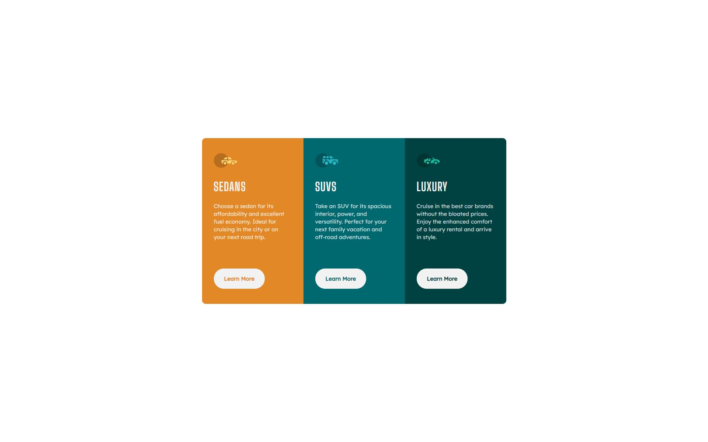
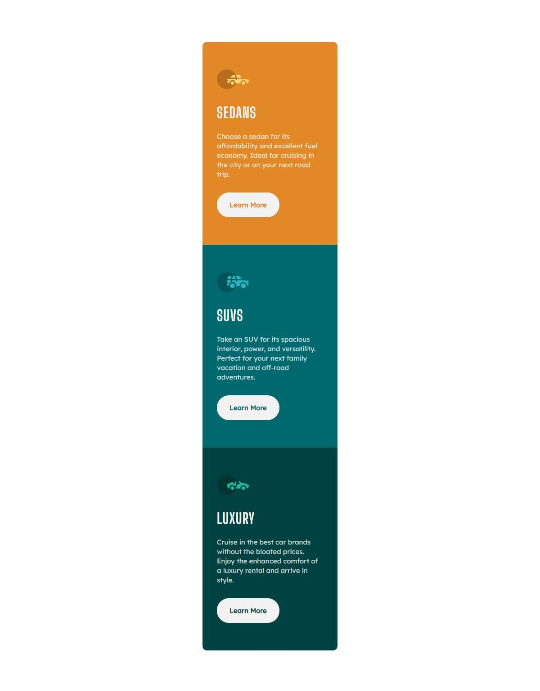
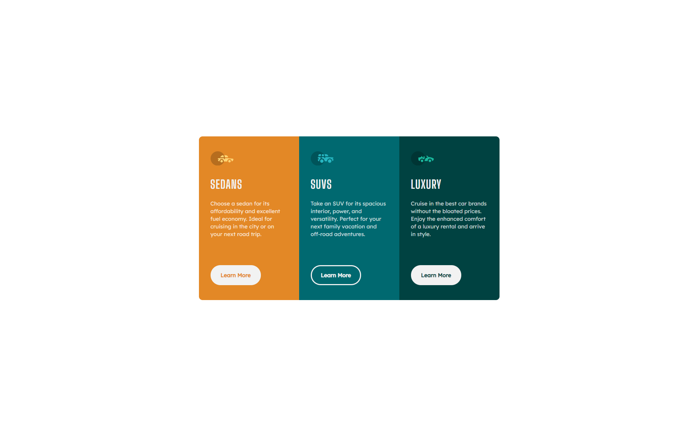

# Frontend Mentor - 3-column preview card component solution

This is a solution to the [3-column preview card component challenge on Frontend Mentor](https://www.frontendmentor.io/challenges/3column-preview-card-component-pH92eAR2-). Frontend Mentor challenges help you improve your coding skills by building realistic projects.

## Table of contents

- [Overview](#overview)
  - [The challenge](#the-challenge)
  - [Screenshot](#screenshot)
  - [Links](#links)
- [My process](#my-process)
  - [Built with](#built-with)
  - [What I learned](#what-i-learned)
- [Author](#author)
- [Acknowledgments](#acknowledgments)

## Overview

### The challenge

Users should be able to:

- View the optimal layout depending on their device's screen size
- See hover states for interactive elements

### Screenshot

### Links

- Solution URL: [Add solution URL here](https://your-solution-url.com)
- Live Site URL: [Add live site URL here](https://your-live-site-url.com)

## My process

I began with a basic layout, adding the image, title, desciption, and button, and then playing with padding, height, and width to get as close to the design as possible. I then split the original component making a reusable card, and button component.

### Built with

- Semantic HTML5 markup
- CSS custom properties
- Flexbox
- Mobile-first workflow
- [React](https://reactjs.org/) - JS library
- [Styled Components](https://styled-components.com/) - For styles

### What I learned

I was recently listening to a JS podcast (sorry, but I cannot for the life of me remember what the podcast was, if I find it I'll add it here) and it motivated me to be mindful of accessbility. So I did some googling on how to make cards accessible, and the finish product is what I came up with. I hope I nailed it lol.

## Author

- Website - [amsiii.dev](soon...)
- Frontend Mentor - [@amsIII](https://www.frontendmentor.io/profile/amsIII)
- Twitter - [@ams3rd](https://www.twitter.com/ams3rd)

## Acknowledgments

Shout out to God and my L&S Jesus! Without God none of this would be possible. While I work hard to become the best dev I can be, but Lord knows how many times imposter syndrome almost convinced me to quit, but I beat it every time! 💪💪💪

FR FR though, iyrt, KEEP GOING!!!
